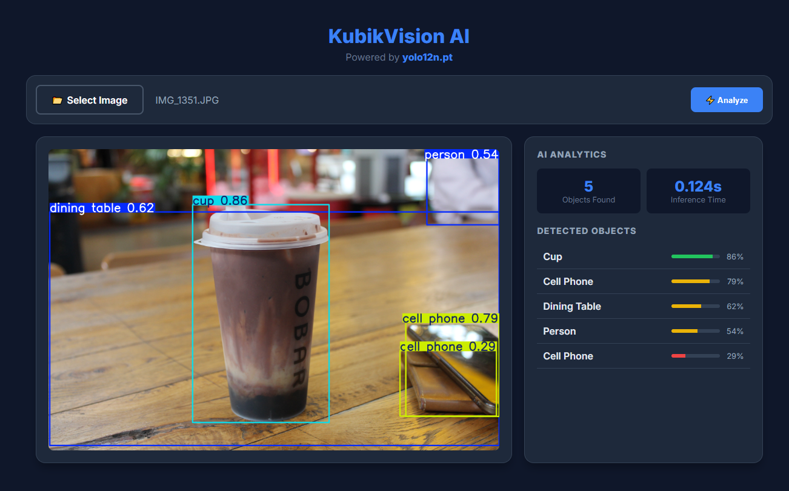

# 👁️ KubikVision AI

**Distributed Enterprise-Grade Computer Vision System**

---

## 🚀 Overview

**KubikVision** is a robust, distributed system designed to process high-load computer vision tasks. Unlike simple scripts, it uses a microservices architecture to decouple the **Web API** (FastAPI) from the **Heavy Computation** (AI Workers).

> **Core Logic:** The user uploads an image -> The API pushes a task to Redis -> A background Celery worker picks it up, runs YOLO12 inference, and saves the result to MinIO -> The Frontend updates in real-time.

---

## ⚡ Key Features (Senior Implementation)

### 🧠 Auto-Healing AI Engine
The system does not rely on hardcoded model versions. It implements a **Smart Discovery Protocol**:
*   Checks for the latest SOTA model (`yolo26n`, `yolo13n`...).
*   Automatically falls back to stable versions (`yolo12n`, `yolo11n`) if bleeding-edge models are unavailable.
*   Prevents system crashes due to missing model files.

### 🛡️ Secure S3 Proxy
Direct access to the storage bucket is restricted for security.
*   **Bad Practice:** Giving public S3 URLs to users.
*   **KubikVision Way:** Implemented a streaming proxy endpoint (`/files/{path}`). The API validates the request and streams bytes securely.

### 📊 Real-Time Analytics Dashboard
A responsive UI built with **Glassmorphism design**:
*   Visualizes Object Detection confidence levels.
*   Calculates Inference Time.
*   Polling mechanism for real-time status updates without WebSockets.

---

## 📂 Project Structure

    kubik_vision/
    ├── docker-compose.yml       # Infrastructure Orchestration
    ├── src/
    │   ├── api/                 # FastAPI Endpoints
    │   ├── core/                # Config & Settings
    │   ├── services/            # Business Logic (S3, Vision)
    │   ├── worker/              # Celery Tasks (AI Processing)
    │   ├── static/              # Frontend (HTML/JS/CSS)
    │   └── main.py              # Entry Point
    └── requirements.txt         # Dependencies

---

## 🚀 How to Run

### 1. Clone the repository
    git clone https://github.com/your-username/KubikVision.git
    cd KubikVision

### 2. Start the Stack (Docker)
    docker-compose up --build

*Wait for the `kubik_worker` to download the AI model (approx. 10-20 seconds).*

### 3. Access the System
*   **Web Dashboard:** http://localhost:8000
*   **Swagger Documentation:** http://localhost:8000/docs
*   **MinIO Console:** http://localhost:9001

---

**Developed by KubikNubika**
*Part of the "Zero to Hero" Challenge*

